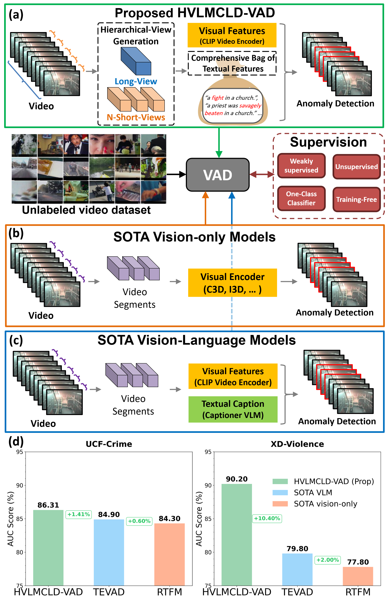

# HVLMCLD-VAD
Code implementation of the paper **"Hierarchical Vision-Language Model with Comprehensive Language Description for Video Anomaly Detection"** by Muaz Al Radi and Sajid Javed.

    

  

## Abstract
Video Anomaly Detection (VAD) is a crucial task in computer vision, with applications in surveillance, transportation, and industrial monitoring. 
Recent advancements in Vision-Language Models (VLMs) have shown promising direction toward VAD in weakly supervised and unsupervised settings by leveraging visual and textual modalities. 
However, existing VLM-based methods often overlook coarse-to-fine temporal information, limiting their ability to handle complex anomalies. 
To address this issue, we propose a hierarchical VLM that enhances visual-textual feature representation by capturing video content at multiple levels of abstraction.
Our algorithm generates a hierarchical view of the video, dividing it into short and long views. 
We extract hierarchical visual features and construct a bag containing comprehensive textual descriptions of anomalies using existing VLMs without relying on ground truth data. 
Our model fuses these modalities and is fine-tuned for anomaly score prediction in weakly supervised, unsupervised, and one-class settings. 
We also introduce a training-free VAD framework based on similarity scores. 
By aligning complex concepts across hierarchical views, our model captures both fine-grained details and high-level contextual information, leading to robust feature representations.
Extensive experiments on UCF-Crime, ShanghaiTech, and XD-Violence datasets demonstrate the superior performance of our method compared to State-Of-The-Art VAD methods.

## Highlights
- We propose a hierarchical VAD model (HVLMCLD-VAD) that captures the video sequence's local and global information at different granularities. Our model, focusing on multiple levels of abstraction learns a more complete understanding of the video's temporal structure and thus robustly detects fine and coarse-grained anomalies. 
- We introduce the concept of comprehensiveness by incorporating a broad array of textual descriptions for the video anomaly, coupled with rich and detailed textual descriptions. For this purpose, we propose a novel comprehensive textual descriptions extraction pipeline leveraging existing VLMs and LLMs.
- We perform extensive experimental evaluations on three publicly available VAD benchmark datasets under different training schemes. Results demonstrated better performance of the HVLMCLD-VAD model compared to existing SOTA methods.

## HVLMCLD-VAD Framework

## Comprehensive Textual Descriptions Generation

## Results
### 📊 Performance comparison on UCF-Crime (UCFC) dataset

*The methods are categorized by supervision type. Best results in **bold**.*

---

#### 🟣 OCC (One-Class Classification)

| Sup. Type | Method | Venue | Features | UCFC AUC |
|-----------|--------|-------|----------|----------|
| **OCC** | **Lu _et al._** | ICCV 2013 | 3DCG-PCA | 65.51 |
|  | **Hasan _et al._** | CVPR 2016 | ConvAE | 50.60 |
|  | **BODS** | ICCV 2019 | I3D-RGB | 68.26 |
|  | **GODS** | ICCV 2019 | I3D-RGB | 70.46 |
|  | **FPDM** | ICCV 2023 | Diffusion Model | 74.70 |
|  | **HVLMCLD-VAD (Prop.)** | -- | CLIP (ViT-B/32) (ZS.) | **78.45** |

---

#### 🟡 Unsupervised

| Sup. Type | Method | Venue | Features | UCFC AUC |
|-----------|--------|-------|----------|----------|
| **Unsupervised** | **AE** | CVPR 2022 | ResNext | 56.32 |
|  | **GCL** | CVPR 2022 | ResNext | 71.04 |
|  | **RareAnom** | Patt. Recog | I3D-RGB | **78.86** |
|  | **HVLMCLD-VAD (Prop.)** | -- | CLIP (ViT-B/32) (ZS.) | 78.45 |

---

#### 🔵 Weakly Supervised

| Sup. Type | Method | Venue | Features | UCFC AUC |
|-----------|--------|-------|----------|----------|
| **Weakly Sup.** | **Sultani _et al._** | CVPR 2018 | C3D | 75.41 |
|  | **GCN-TSN** | CVPR 2019 | TSN-RGB | 82.12 |
|  | **SA-CRF** | ICCV 2021 | TSN-ResNet | 85.00 |
|  | **RTFM** | ICCV 2021 | I3D-RGB | 84.30 |
|  | **MIST** | CVPR 2021 | I3D-RGB | 82.30 |
|  | **CUPL** | CVPR 2023 | I3D-VGGish | 86.22 |
|  | **UMIL** | CVPR 2023 | X-CLIP-B/32 (FT.) | 86.75 |
|  | **TeD-SPAD** | ICCV 2023 | UNet-I3D | 75.06 |
|  | **CLAV** | CVPR 2023 | I3D-RGB | 86.10 |
|  | **TPWNG** | CVPR 2024 | CLIP (VIT-B/16) (FT.) | **87.79** |
|  | **HVLMCLD-VAD (Prop.)** | -- | CLIP (ViT-B/32) (ZS.) | 86.31 |

---

#### 🔴 Training-Free

| Sup. Type | Method | Venue | Features | UCFC AUC |
|-----------|--------|-------|----------|----------|
| **Training-Free** | **ZS CLIP** | CVPR 2024 | ViT | 53.16 |
|  | **ZS ImageBind (Img)** | CVPR 2024 | ViT | 53.65 |
|  | **ZS ImageBind (Vid)** | CVPR 2024 | ViT | 55.78 |
|  | **LLAVA-1.5** | CVPR 2024 | ViT | 72.84 |
|  | **CLIP-dict (Prop.)** | -- | ViT | 62.39 |
|  | **CLIP-dict w.DDM (Prop.)** | -- | ViT | 62.79 |
|  | **HVLMCLD-VAD (Prop.)** | -- | ViT | 75.91 |
|  | **HVLMCLD-VAD w.DDM (Prop.)** | -- | ViT | **76.89** |

---
