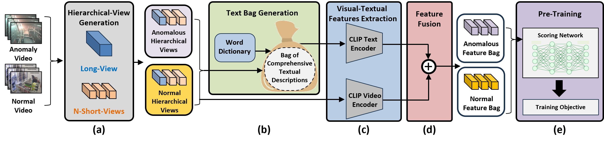
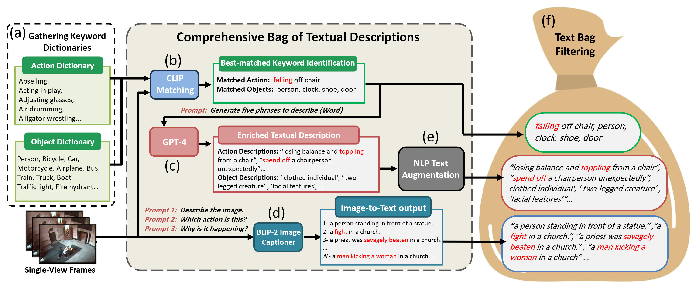

# HVLMCLD-VAD

The official implementation for **HVLMCLD-VAD: Hierarchical Vision-Language Model with Comprehensive Language Description for Video Anomaly Detection**.

📄 Submitted to *Knowledge-Based Systems, 2025*

## HVLMCLD-VAD Framework






## 🔥 Highlights

- 📚 Introduces a **hierarchical** VAD framework capturing both local and global video context.
- 🧠 Leverages **comprehensive textual descriptions** generated from VLMs and LLMs (e.g., CLIP, BLIP-2, GPT-4).
- 💡 Supports multiple learning paradigms: **Weakly-supervised**, **Unsupervised**, **One-Class**, and **Training-Free**.
- 🏆 Achieves **state-of-the-art performance** on UCF-Crime, ShanghaiTech, and XD-Violence datasets.

## 📦 Installation

### Option 1: Manual setup
```bash
conda create -n hvlmcld python=3.8 -y
conda activate hvlmcld
bash install_env.sh
````

### Option 2: With environment file

```bash
conda env create -f hvlmcld_env.yaml
conda activate hvlmcld
```

## 🚀 HVLMCLD-VAD Pipeline

Set up local paths:
```bash
python create_default_local_file.py --workspace_dir . --data_dir ./data --save_dir ./output
```

### 1️⃣ Data Preparation

Expected directory structure:

```
data/
├── ucf_crime/
│   ├── videos/
│   │   ├── Abuse/
│   │   │   ├── Abuse001_x264.mp4
│   │   │   ├── Abuse002_x264.mp4
│   │   ├── Arrest/
│   │   │   ├── Arrest001_x264.mp4
│   │   ├── Explosion/
│   │   │   ├── Explosion001_x264.mp4
│   │   └── ...
│   └── labels/
│       ├── UCF_train_anomaly.txt
│       ├── UCF_train_normal.txt
│       ├── UCF_test_anomalyv2.txt
│       └── UCF_test_normalv2.txt
│
├── shanghai_tech/
│   ├── videos/
│   │   ├── 01_001.avi
│   │   ├── 01_002.avi
│   │   ├── 02_003.avi
│   │   └── ...
│   └── labels/
│       ├── SHT_train_anomaly.txt
│       ├── SHT_train_normal.txt
│       ├── SHT_test_anomalyv2.txt
│       └── SHT_test_normalv2.txt
│
├── xd_violence/
│   ├── videos/
│   │   ├── v=tSnxeqlN7wA__#1_label_A.mp4
│   │   ├── v=TtwkuoaI2Iw__#1_label_A.mp4
│   │   ├── v=UM0jtD_OWLU__#1_label_G-0-0.mp4
│   │   └── ...
│   └── labels/
│       ├── XDV_train_anomaly.txt
│       ├── XDV_train_normal.txt
│       ├── XDV_test_anomalyv2.txt
│       └── XDV_test_normalv2.txt
│
├── keyword_dictionaries/
│   ├── K700_action_keywords.txt        # Keyword dictionary for actions from K700
│   └── COCO_object_keywords.txt        # Keyword dictionary for objects from COCO
│
├── gpt_descriptions/
│   ├── gpt_action_expanded.txt         # Expanded GPT-4 phrases for actions
│   └── gpt_object_expanded.txt         # Expanded GPT-4 descriptions for objects
│
├── training_free_dictionaries/
│   ├── gpt_actions
│   │   ├── gpt_actions_normal.txt
│   │   └── gpt_actions_anomaly.txt
│   ├── k700_actions
│   ├── gpt+k700_actions
│   ├── gpt_objects
│   ├── coco_objects
│   ├── gpt+coco_objects
```

📥 Download and prepare the datasets from their official sources (as video files):

* [UCF-Crime](https://www.crcv.ucf.edu/projects/real-world/)
* [ShanghaiTech (video files)](https://kuacae-my.sharepoint.com/:u:/g/personal/100059660_ku_ac_ae/EdpsLBm8SNBLu9X47Sj1dvcBVK_FbrdMl_B8ojOphJ2Kjw?e=2t1fab)
* [XD-Violence](https://roc-ng.github.io/XD-Violence/)

📥 Download the keyword dictionaries (download from `lib/keyword_dictionaries`).

📥 Download the expanded GPT-4 descriptions (download from `lib/gpt_descriptions`).

✅ For each dataset:

* The `videos/` directory contains the raw video files.

  * **UCF-Crime** and **ShanghaiTech** follow category- or scene-based naming or folders.
  * **XD-Violence** contains **all video files flat** under `videos/`.

* The `labels/` directory must include (download from `lib/labels/<dataset_name>`):

  * `<PREFIX>_train_anomaly.txt`
  * `<PREFIX>_train_normal.txt`
  * `<PREFIX>_test_anomalyv2.txt`
  * `<PREFIX>_test_normalv2.txt`


👉 Place each dataset inside the corresponding folder in `./data`. All preprocessing and feature extraction scripts assume this structure.

---

### 2️⃣ Feature Extraction

#### 2.1 Comprehensive Bag of Textual Descriptions + Visual Features

A **single unified script** handles both the generation of textual descriptions and extraction of visual features.

It combines:
- 🎯 CLIP-based matching using COCO/Kinetics dictionaries
- 🧠 GPT-4 expansions from `data/gpt_descriptions/`
- 🖼️ BLIP-2 image-to-text generation (optional)
- 🔍 Visual feature extraction using CLIP ViT (segment-based)
- 📚 NLP augmentations (e.g., synonyms)

📌 **Run the full pipeline:**
```bash
python generate_text_bag.py \
  --dataset ucf_crime \
  --data_dir ./data \
  --save_txt True \
  --save_json True \
  --extract_visual True \
  --views 32 \
  --long_view True
````

🧾 **Arguments Overview**:

| Argument           | Description                                                             |
| ------------------ | ----------------------------------------------------------------------- |
| `--dataset`        | One of `ucf_crime`, `shanghai_tech`, or `xd_violence`                   |
| `--data_dir`       | Root directory containing `videos/`, `labels/`, and `gpt_descriptions/` |
| `--save_txt`       | Whether to save the generated text bag as `.txt` (e.g., for ablation)   |
| `--save_json`      | Whether to save structured text bag as `.json` (for model input)        |
| `--extract_visual` | If `True`, extracts CLIP-based visual features and saves `.npy` files   |
| `--views`          | Number of segments/views per video (e.g., `16`, `32`)                   |
| `--long_view`      | If `True`, enables extraction of long-range temporal context            |

📂 **Output Structure (auto-created):**

```
output/
├── text_bags/
│   ├── ucf_crime/
│   │   ├── Abuse/
│   │   │   ├── Abuse001_x264.mp4.txt
│   │   │   ├── Abuse002_x264.mp4.txt
│   │   │   ├── ...
│   │   ├── ...
│   └── ...
├── visual_features/
│   ├── ucf_crime/
│   │   ├── Abuse/
│   │   │   ├── Abuse001_x264.mp4.npy
│   │   │   ├── Abuse002_x264.mp4.npy
│   │   │   ├── ...
│   │   ├── ...
│   └── ...
```

✅ The script automatically:

* Loads GPT-4 expansions from `data/gpt_descriptions/gpt_action_expanded.txt` and `gpt_object_expanded.txt`
* Scans video clips from `data/<dataset>/videos/`
* Associates them using `data/<dataset>/labels/*.txt`

💡 You can enable or disable visual/text feature extraction independently via the boolean flags.

📥 You can download the extracted features from the three datasets using the following links:

* [UCF-Crime](https://kuacae-my.sharepoint.com/:u:/g/personal/100059660_ku_ac_ae/EfYzLPz5judOjnjP-ZaNh5QBqzmO2fDhNSZ5jtE5nEyYdA?e=szqGUi)
* [ShanghaiTech](https://kuacae-my.sharepoint.com/:u:/g/personal/100059660_ku_ac_ae/EYQrpx7HIw9Ku8O8Eh63cH0B_Mv7IuN1z_152KKGxtfbpA?e=6Sh04Z)
* [XD-Violence](https://kuacae-my.sharepoint.com/:u:/g/personal/100059660_ku_ac_ae/ESsS1vq4q3BJhSPCeE8tRQMB_BbvevXBzFIuLTR5Wji1rA?e=tRzdPM)

📥 You can download the extracted BLIP-2 captions from the UCF-Crime dataset using the following links [UCF-Crime BLIP2 captions](https://kuacae-my.sharepoint.com/:u:/g/personal/100059660_ku_ac_ae/ETjQoW4xO-FFuF2ynbK8ZEsBDrE8rUSrPj6c1zOo-8D9Cw?e=OckreM)


---

### 3️⃣ Model Training and Evaluation

#### 3.1 Weakly Supervised

Train a weakly-supervised model and save the checkpoint:
```bash
python train.py \
  --config weakly_sup \
  --save_dir ./output \
  --save_model True \
  --model_name weakly_ucf.pth
````

📁 Saved to: `./output/checkpoints/weakly_ucf.pth`

---

#### 3.2 Unsupervised (Generator–Discriminator)

Train an unsupervised model (e.g., with feature reconstruction or contrastive learning):

```bash
python train.py \
  --config unsup \
  --save_dir ./output \
  --save_model True \
  --model_name unsup_ucf.pth
```

📁 Saved to: `./output/checkpoints/unsup_ucf.pth`

---

#### 3.3 One-Class Classifier

Train a model using one-class classification (e.g., SVDD or center loss):

```bash
python train.py \
  --config occ \
  --save_dir ./output \
  --save_model True \
  --model_name occ_ucf.pth
```

📁 Saved to: `./output/checkpoints/occ_ucf.pth`

---

#### 3.4 Training-Free Inference

This method bypasses model training and directly matches video features to dictionary embeddings.

🧪 **Without** dictionary distance maximization (DDM):

```bash
python test_dict_matching.py \
  --dataset ucf_crime \
  --dictionary action_gpt4
```

🧪 **With** dictionary distance maximization (DDM enabled by default):

```bash
python test_dict_matching.py \
  --dataset ucf_crime \
  --dictionary action_gpt4 \
  --use_dmm True
```

This approach matches each video feature to textual embeddings from the **comprehensive bag of textual descriptions** generated earlier, making it a fast zero-shot baseline.

---

### 5️⃣ Model Visualization

#### 📈 Anomaly Score Curves

Generate anomaly score plots over time for qualitative evaluation. Here are some usage examples:

```bash
# Process all videos from UCF-Crime dataset
python visualize_scores.py --dataset ucf_crime --model_path ./output/<model_file>.pth --all_videos

# Process 10 random videos
python visualize_scores.py --dataset ucf_crime --model_path ./output/<model_file>.pth --num_random 10

# Process specific video
python visualize_scores.py --dataset ucf_crime --model_path ./output/<model_file>.pth --video_name Abuse001_x264.mp4

# Use different dataset
python visualize_scores.py --dataset shanghai_tech --model_path ./output/<model_file>.pth --all_videos

# Custom data root and output directory
python visualize_scores.py --dataset ucf_crime --model_path ./output/<model_file>.pth --data_root /path/to/data --output_dir ./custom_output --num_random 5
````

#### 🎞️ Anomaly Overlay Rendering

Render anomaly scores directly onto video frames (e.g., top-left corner), creating annotated videos for easy visual inspection:

```bash
# Process all videos from UCF-Crime dataset
python render_anomaly_overlay.py \
  --dataset ucf_crime \
  --model_path ./output/ucf_model.pth \
  --save_video True \
  --output_dir ./output/visualizations/ \
  --all_videos

# Process specific video
python render_anomaly_overlay.py \
  --dataset ucf_crime \
  --model_path ./output/ucf_model.pth \
  --save_video True \
  --output_dir ./output/visualizations/ \
  --video_name Abuse001_x264.mp4

# Process 5 random videos with custom threshold
python render_anomaly_overlay.py \
  --dataset shanghai_tech \
  --model_path ./output/model.pth \
  --save_video True \
  --output_dir ./custom_output/ \
  --num_random 5 \
  --score_threshold 0.7

```

🧾 **Options**:

* `--save_video`: Set to `True` to export the visualization as a `.mp4`
* `--output_dir`: Path to save rendered videos with anomaly overlays
* `--dataset`: Dataset name
* `--model_path`: Path to the trained model or anomaly score file
* `--score_threshold`: Anomaly classification threshold (default: 0.5)
* `--show_ground_truth`: Enable/disable ground truth comparison
* `--input_dim`: Model input dimension (default: 10752)


📺 Example output:

```
output/
└── visualizations/
    ├── Abuse001_x264_overlay.mp4
    ├── Arrest002_x264_overlay.mp4
    └── ...
```

Each video will display:

* Frame-by-frame view of the input video
* Real-time anomaly score on the top-left corner (0.00 to 1.00)
* Color-coded system immediately shows detection accuracy

This makes qualitative assessment and demonstration highly intuitive.


## ⚙️ Citation

Please cite our work if you use HVLMCLD-VAD in your research:

```bibtex
@article{alradi2025hvlmcldvad,
  title={Hierarchical Vision-Language Model with Comprehensive Language Description for Video Anomaly Detection},
  author={Al Radi, Muaz and Javed, Sajid},
  journal={Knowledge-Based Systems},
  year={2025}
}
```

## 🤝 Acknowledgments

* Thanks for the authors of [CLIP](https://github.com/openai/CLIP), [BLIP-2](https://github.com/salesforce/LAVIS), [GPT-4](https://openai.com/research/gpt-4), and [LAVAD](https://github.com/lucazanella/lavad), which helps us to implement our ideas.
* We sincerely acknowledge the contributions of the referenced works, whose ideas and publicly shared code have significantly influenced this project. Their openness and innovation have provided a strong foundation upon which this research was built.
* We extend our gratitude to Dr. Said Boumaraf for his support in providing the computational resources necessary to conduct our experiments.


## 📬 Contact

For questions, contact:
📧 [100059660@ku.ac.ae](mailto:100059660@ku.ac.ae)
